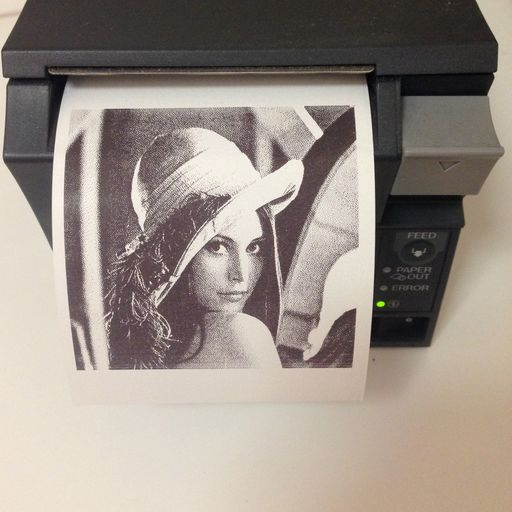
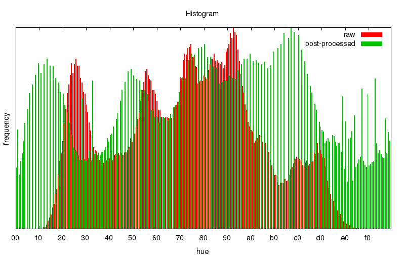

# png2pos

[](https://travis-ci.org/petrkutalek/png2pos)

**NOTE: png2pos fulfills its purpose and does it well. I probably do not intend to develop it any more. It is licensed under MIT: anyone can use it for free, anyone has the right to modify it unless the name "png2pos" is being used for further releases.**

png2pos is a utility to convert PNG images to ESC/POS format (printer control codes and escape sequences) used by POS thermal printers. Output file can be just sent to printer.

**png2pos does not contain any Epson drivers, it is not a driver/filter replacement… png2pos is just a utility for embedded projects, for whose printing PNG files is sufficient and ideal lightweight solution.**

png2pos is:

* **free** and open-source
* rock **stable**
* highly **optimized**, fast, tiny and lightweight (few KiBs binary, no lib dependencies)
* **secure** (does not require any escalated privileges)
* using **high-quality** algorithms
* easy to use
* multiplatform (tested on Linux — x86 and ARM/Raspberry Pi, OS X and Windows)
* well **tested**
* 100% handcrafted in Prague, CZ :-)

## Printing on Windows

In file [print.cmd](./print.cmd) replace PRINTER with your printer's device. Now you can drag & drop your PNG file into this shortcut to directly print it on your thermal printer.
For further details, please check [this blog post](https://mike42.me/blog/2015-04-getting-a-usb-receipt-printer-working-on-windows).

## How does it work?

It accepts any PNG file (B/W, greyscale, RGB, RGBA), applies Histogram Equalization Algorithm and via Atkinson Dithering Algorithm converts it to B/W bitmap wrapped by ESC/POS commands.

ESC/POS is a printer language. The “POS” stands for “Point of Sale”, the “ESC” stands for “escape” because command instructions are escaped with a special characters. png2pos utilizes ```ESC@```, ```GSV```, ```GSL```, ```GS8L``` and ```GS(L``` ESC/POS commands. It also prepends needed printer initialization binary sequences and adds paper cutoff command, if requested.

png2pos requires 5 × WIDTH (rounded up to multiple of 8) × HEIGHT bytes of RAM. (e.g. to process full-width image of receipt 768 pixels tall you need about 2 MiB of RAM.)

png2pos converts RGBA images into greyscale version via algorithm compliant with ITU-R, BT.709. (RGBA → RGB → R'G'B' (gamma 2.2) → luma Y' → lightness L*). For performance reasons png2pos uses pre-calculated lookup tables and integer based math.


## Pricing and Support

png2pos is free MIT-licensed software provided as is. If you like png2pos and use it, please let me know, it motivates me in further development.

**Unfortunately I am unable to provide you with free support. Please, do not ever ask me to assist you with source code modifications or to make a special build for you etc., if you use png2pos for your business (especially if you have not donated to its development). It is your job you are paid for.**

Important: png2pos will *never ever* be like Emacs; it is simple and specialized utility.

There is also an alternative project called [png2escpos](https://github.com/twg/png2escpos) created by The Working Group Inc. It's younger, simpler and uses libpng. png2pos is in all aspects mature, nevertheless you may like alternative even more.

## Build

You have to build binary file yourself. Clone the source code:

    $ git clone --recursive https://github.com/petrkutalek/png2pos.git ↵
    $ cd png2pos ↵

To build and install binary just type:

    $ make install ↵

On Mac typically you can use clang preprocessor:

    $ make CC=clang install ↵

On Linux you can also build static binary (e.g. also based on [musl](http://www.musl-libc.org/intro.html)):

    $ make CC=/usr/local/musl/bin/musl-gcc static ↵
    $ make install ↵

Windows binary is build in MinGW by (MinGW must be included in PATH):

    C:\devel\png2pos> mingw32-make -f Makefile.win strip ↵

png2pos has no lib dependencies and is easy to build and run on Linux, Mac and Windows.

## Usage examples

    $ png2pos -c -p -o /dev/usb/lp0 /tmp/image.png ↵

or

    $ png2pos -c -p /tmp/image.png > /dev/usb/lp0 ↵

Please see man page:

    $ man png2pos ↵

## Example

### Lena

Below you can see each step (with its intermediate product) image passes through during the image processing:

* Top: Original (24 bits per pixel)
* Left: Greyscale version (8 bits per pixel)
* Right: Post-processed version (Histogram Equalization Algorithm, 8 bits per pixel)
* Bottom: Produced B/W dithered version (Atkinson Dithering Algorithm, 1 bit per pixel)


Final copy



Histograms (raw and post-processed images)


